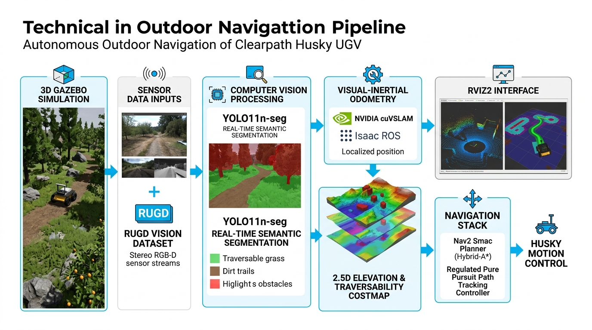
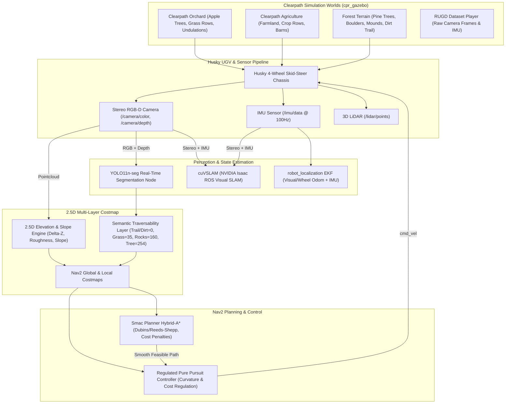
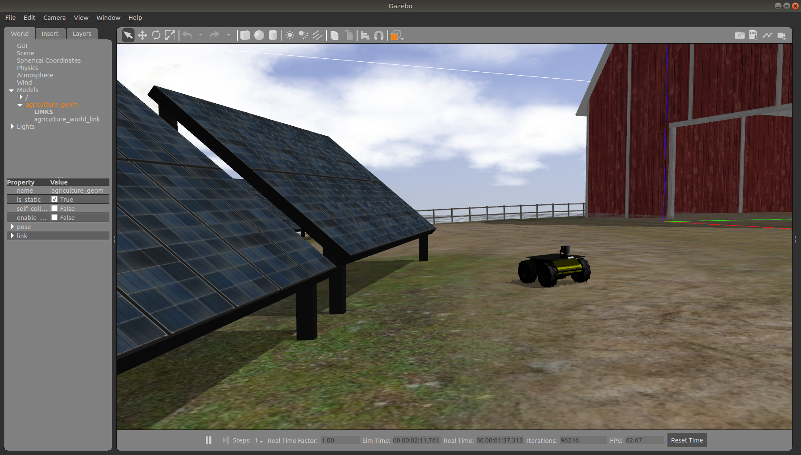
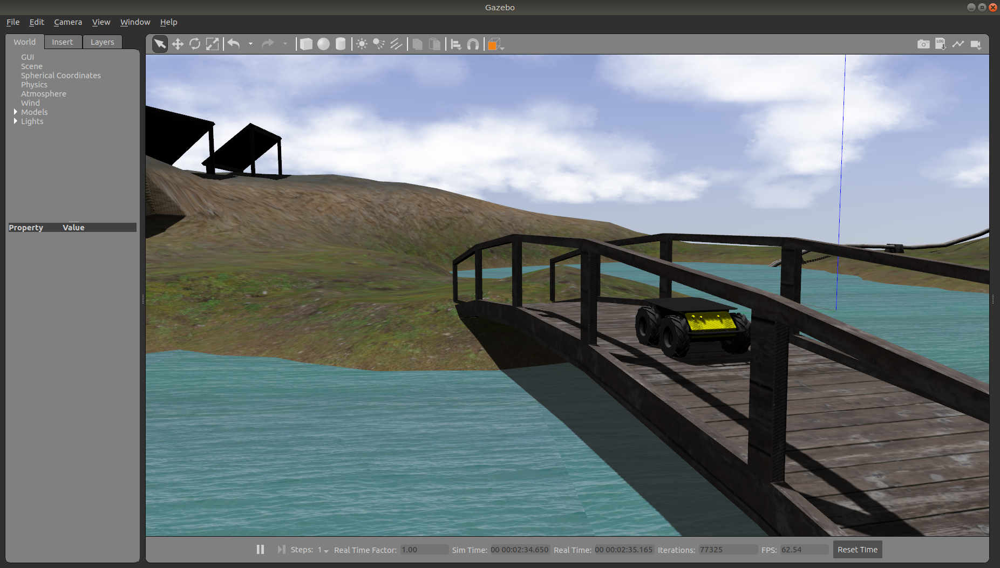
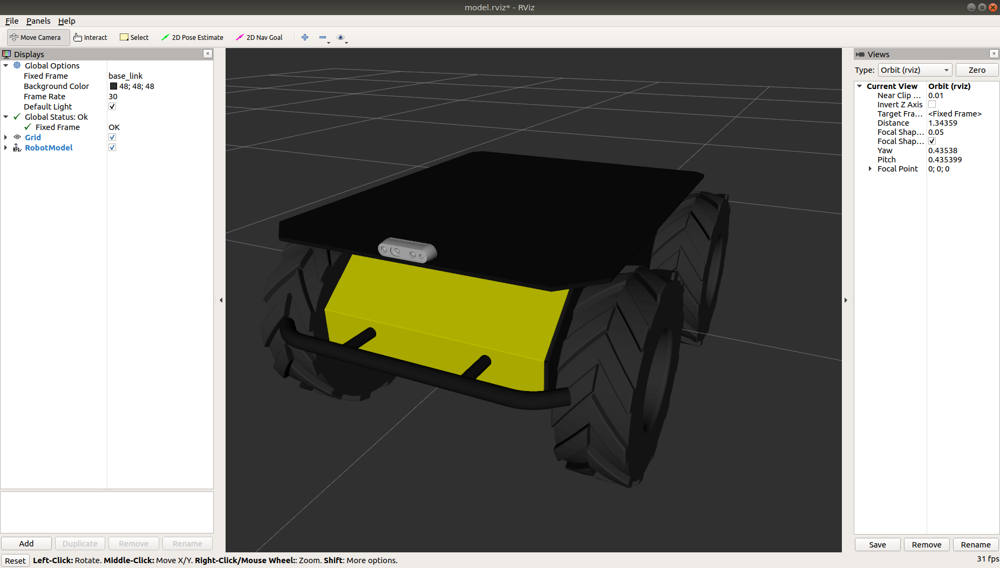
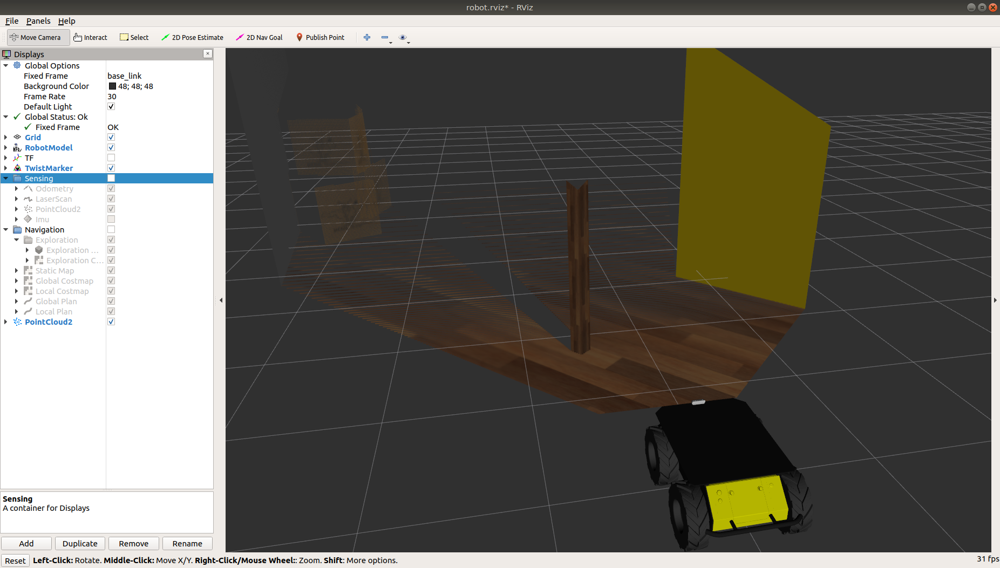

# Nexora Vision V1.0: Clearpath Husky UGV Outdoor Autonomous Navigation Stack

Comprehensive ROS 2 Humble autonomous navigation stack supporting Clearpath's official outdoor simulation environments (**Clearpath Orchard**, **Clearpath Agriculture**, and **Forest Terrain**) with an end-to-end vision-guided autonomy pipeline:

$$\text{Gazebo Husky UGV} \longrightarrow \text{Camera/IMU} \longrightarrow \text{YOLO11n-seg} \longrightarrow \text{cuVSLAM} \longrightarrow \text{2.5D Costmap} \longrightarrow \text{Smac Hybrid-A*} \longrightarrow \text{Regulated Pure Pursuit} \longrightarrow \text{Husky Motion}$$

---

## 🌟 Architecture & Dataflow





---

## 🌍 Supported Simulation Worlds
1. **Clearpath Orchard (`world:=orchard`)**:
   - Official Clearpath Orchard world with high-detail apple trees, foliage, grassy rows, terrain undulations, and solar stations.
   - Ideal for testing navigation through narrow tree corridors and row-following.
2. **Clearpath Agriculture (`world:=agriculture`)**:
   - Official Clearpath Agriculture environment with farmland elevation, crop rows, and fencing.
   - 
3. **Clearpath Inspection Bridge**:
   - High-fidelity industrial inspection facility with bridge structure, solar arrays, and waterways.
   - 
4. **Forest Terrain (`world:=forest`)**:
   - Outdoor dense forest with pine trees, boulder clusters, stone fields, bushes, and an unpaved dirt trail.

---

## 📷 Vision & Sensor Integration

| Stereo RGB-D & Depth Sensing | RViz2 Pointcloud & Traversal Visualization |
| :---: | :---: |
|  |  |

---

## 🚀 Quickstart Commands

### 1. Source Environment
```bash
source /opt/ros/humble/setup.bash
source /home/user/ros2_ws/install/setup.bash
```

### 2. Launch with Clearpath Orchard World
```bash
ros2 launch husky_outdoor_nav full_husky_system.launch.py world:=orchard
```

### 3. Launch with Clearpath Agriculture World
```bash
ros2 launch husky_outdoor_nav full_husky_system.launch.py world:=agriculture
```

### 4. Launch with Forest Terrain World
```bash
ros2 launch husky_outdoor_nav full_husky_system.launch.py world:=forest
```

### 5. Autonomous Waypoint Patrol (in a second terminal)
```bash
source /opt/ros/humble/setup.bash
source /home/user/ros2_ws/install/setup.bash
ros2 run husky_outdoor_nav goal_patrol_node
```

---

## 📊 Pipeline Parameters Summary

- **YOLO11n-seg**: Runs on `/camera/color/image_raw`, classifies terrain/objects, generates `/perception/segmented_image`, mono cost mask `/perception/traversability_cost_image`, and 3D semantic point cloud `/perception/semantic_pointcloud`.
- **cuVSLAM & EKF**: Real-time visual-inertial state estimation fusing stereo RGB-D optical frames with $100\text{ Hz}$ IMU (`/imu/data`).
- **2.5D Costmap**: Evaluates step height $\Delta Z > 0.18\text{ m}$, slope $\theta > 22^\circ$, and roughness, fused with semantic weights in [`elevation_costmap_25d_node.py`](file:///home/user/ros2_ws/src/husky_outdoor_nav/husky_outdoor_nav/elevation_costmap_25d_node.py).
- **Smac Planner Hybrid-A\***: Non-holonomic Dubins/Reeds-Shepp search with 72 angular bins and cost penalty of $2.5$ in [`nav2_smac_rpp_params.yaml`](file:///home/user/ros2_ws/src/husky_outdoor_nav/config/nav2_smac_rpp_params.yaml).
- **Regulated Pure Pursuit (RPP)**: Velocity-scaled lookahead ($0.4\text{ m} \to 1.8\text{ m}$), curvature regulation, and proximity-to-obstacle speed scaling.
